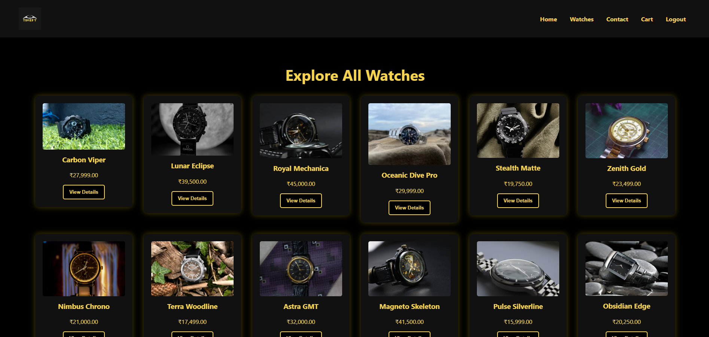
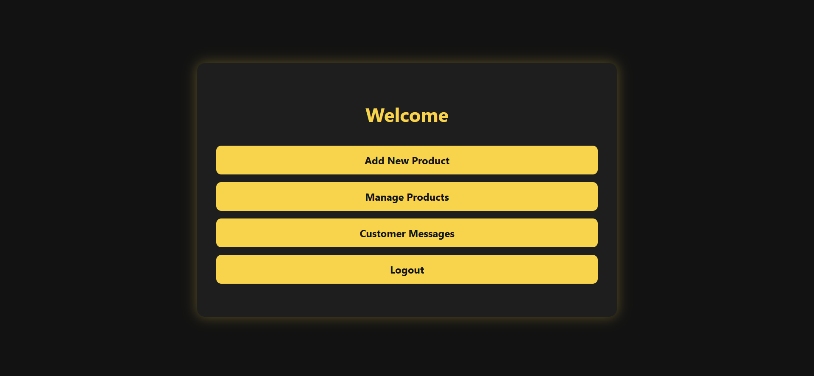

<h1 align="center">
  ⌚️ Timefy – Watches E-Commerce Website ⌚️
</h1>


<p align="center">
  <b>Premium watch shopping, redefined.</b><br/>
  Stylish. Modern. Responsive. Built with ❤️ using PHP, MySQL, HTML, CSS & JS.
</p>

---

## 🌟 Features

- 🛒 User-friendly shopping interface  
- 🔐 Secure login & registration (MySql)  
- 💬 Contact form with admin panel  
- 🖤 Black & Yellow sleek UI design  
- 📱 Fully responsive for all devices 

---

## 🚀 Tech Stack

- ⚙️ HTML, CSS, JavaScript  
- 🐘 PHP & MySQL    
- 🧠 Git & GitHub

---

## 📸 Screenshots

| Homepage | Product Page | Admin Panel |
|---------|--------------|-------------|
|  |  |  |

> Replace the above image links with real screenshots of your website.

---


📬 Contact
📧 Email: hashirali0260@gmail.com

<p align="center">   <br/> <b>Thanks for visiting Timefy! Stay timeless. ⌚</b> </p> ```

## ⚙️ Setup Instructions

```bash
# Clone the repo
git clone https://github.com/hashir0260/Timefy-Watches-E-Commerce-Website.git

# Start your PHP server (e.g., XAMPP/Laragon)
# Import the database from /db into phpMyAdmin


